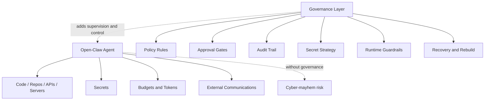
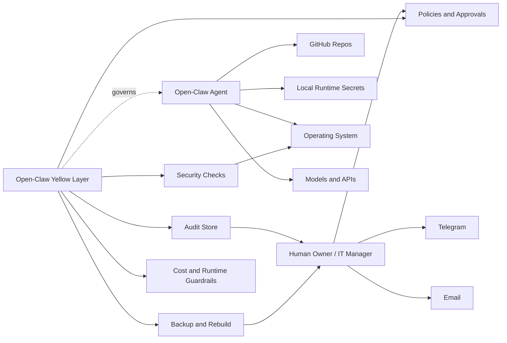
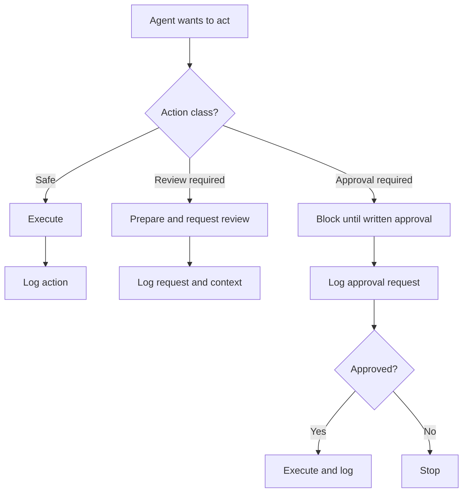

# 🟡 Open-Claw Yellow

> **The Yellow Open-Claw Project**
> **A practical AI and cyber governance layer for Open-Claw operators**

---

## 🚦 Status

**Draft v0.2**
**Updated:** 2026-04-10
**Positioning:** open community initiative, practical governance layer, security-first operator model

---

## ✨ Executive summary

> 🟡 **Why Yellow?** In the cybersecurity color-wheel model, Yellow is commonly associated with **secure development**: building systems with security in mind from the start. Open-Claw Yellow extends that logic to AI operators by combining secure development, operational guardrails, traceability, and governance.
> Open-Claw Yellow is a practical effort to add a missing layer of **governance, traceability, approval control, secret handling, and operational safety** around Open-Claw deployments.

The problem is no longer theoretical.

Agent systems are increasingly able to:

* read repositories
* write code
* use secrets
* consume budget
* talk to external systems
* act with partial autonomy

That creates a dangerous gap between what an AI operator can do and what an organization can actually **supervise, approve, audit, recover, and trust**.

Open-Claw Yellow is an attempt to reduce that gap.

> 🟡 **Core intuition:** powerful AI operators need visible guardrails, not blind trust.

It is **not** a criticism of Open-Claw. It is a practical answer to a missing layer that many IT managers, technical leads, and operators will need before allowing an AI agent to act inside a real environment.

---

## 🎨 Yellow in the cyber color wheel

Yellow already has a strong meaning for many cyber and engineering professionals.

In the extended cybersecurity color-wheel model:

* **Red** tests and attacks
* **Blue** detects and defends
* **Purple** improves the loop between offense and defense
* **Green** bridges DevOps and operational security
* **White** governs, audits, and sets rules
* **Yellow** helps ensure systems are **built securely by design**

Open-Claw Yellow is intentionally named for that Yellow space.

It focuses on the point where:

* software engineering
* AI operator design
* secure-by-default implementation
* practical governance
* traceability

must meet.

This project therefore speaks directly to:

* full-stack developers building agent-enabled systems
* cyber engineers who do not want AI operations to become ungoverned attack surfaces
* IT and security managers who need bounded autonomy rather than blind trust

> 🟡 **Positioning:** Open-Claw Yellow sits primarily in the Yellow zone, while intentionally interfacing with White, Blue, Green, and Purple concerns.

## ⚠️ Why this matters

### 🚨 The current risk

Today, many agent deployments are built first for:

* speed
* demos
* experimentation
* developer convenience

That is understandable.

> ⚡ **But once an agent can touch code, infrastructure, tokens, costs, or organizational workflows, the absence of governance becomes a recipe for cyber-mayhem.**

### 🧩 Typical weak points

* poor traceability of what the agent did and why
* no structured approval path for risky actions
* unclear handling of secrets and tokens
* no distinction between safe actions and privileged actions
* weak rebuild capability after failure or compromise
* insufficient supervision of model usage, costs, and autonomy
* lack of operational visibility into the environment the agent is running in

> For hobby usage, this may be acceptable.
> For professional usage, it is not.

---

## 🖼️ The idea in one picture

---

## 🌍 Project vision

Open-Claw Yellow aims to make AI operator deployments safer not only for operators, but also for the teams around them.

It is fundamentally a **secure development and governance project for AI operators**.
Open-Claw Yellow aims to make AI operator deployments more:

* governable
* auditable
* reviewable
* resilient
* explainable

The long-term objective is to create a reusable governance layer that can sit around Open-Claw and similar agent systems.

> 🌐 **Ambition:** make AI operator deployments safer, more reviewable, and easier to trust in real organizations.

This layer should help organizations answer basic but critical questions:

| Question                              | Why it matters         |
| ------------------------------------- | ---------------------- |
| What did the agent do?                | Traceability           |
| Why did it do it?                     | Explainability         |
| Was it allowed?                       | Policy enforcement     |
| Who approved it?                      | Human accountability   |
| Which secret did it access?           | Secret governance      |
| Which branch did it touch?            | Change control         |
| Which cost did it generate?           | Budget control         |
| Which environment change did it make? | Ops safety             |
| Can we rebuild after failure?         | Operational resilience |
| Can we investigate compromise?        | Incident response      |

---

## 🤝 Relationship to other cyber teams

Open-Claw Yellow is not meant to replace other security functions. It is meant to strengthen the AI operator layer so it can integrate more cleanly with them.

| Team color | Relationship with Open-Claw Yellow                                    |
| ---------- | --------------------------------------------------------------------- |
| Red        | Helps define what should be testable and challengeable                |
| Blue       | Benefits from better logs, clearer events, and operational visibility |
| Purple     | Gains a better framework for feedback loops and adversarial learning  |
| Green      | Connects to DevSecOps, host hardening, logging, and secure SDLC       |
| White      | Gains policy, approval paths, governance signals, and traceability    |
| Gray       | Can help inform future threat models for AI operator misuse           |

> 🧠 **Interpretation:** Yellow does not compete with those teams. It helps ensure AI operators are built and run in ways those teams can actually supervise and trust.

## 🧭 Design principles

### 1. Practical first

The system must help in real-world operations quickly. It must not require a large enterprise rollout just to gain basic safety.

### 2. Minimal trusted autonomy

The agent may execute tasks, but high-risk actions must remain bounded, classified, and reviewable.

### 3. Traceability by default

Important actions must leave an understandable trail for both humans and machines.

### 4. Secrets are assets

Secrets are not mere configuration. They are controlled assets and must be handled accordingly.

### 5. Rebuildability matters

A deployment that cannot be rebuilt cleanly after compromise or failure is not operationally mature.

### 6. Human override is mandatory

A human owner or manager must remain capable of supervising, constraining, and approving critical actions.

### 7. Reuse before reinvention

Where mature tools already exist, they should be reused. The project should build the missing governance glue, not rebuild entire security platforms from scratch.

---

## 🎯 Scope

Open-Claw Yellow is **not** intended to redesign Open-Claw itself.

It is intended to provide a **modular governance and safety layer around it**.

### ✅ In scope

* governance policy
* approvals
* auditability
* secret strategy
* runtime guardrails
* operational visibility
* rebuild and recovery patterns

### ⛔ Out of scope

* replacing Open-Claw core functionality
* building a full enterprise compliance suite
* building a full SIEM
* solving every security issue automatically

---

## 🧱 What Open-Claw Yellow is expected to provide

### 🏛️ Governance and policy

* action classes and decision boundaries
* approval-required actions
* forbidden actions
* project scope boundaries
* model usage policy
* repo access policy
* communication and escalation policy

### 🧾 Traceability and audit

* action logging
* approval logging
* elevation logging
* secret-access metadata logging
* confidential-information handling logs
* payment and spend tracking metadata
* human-readable and machine-readable records

### 🔐 Secret and token handling

* separation of runtime secrets and shared organizational secrets
* support for encrypted secret backup
* support for local secret access patterns
* support for controlled release of secrets to runtime
* no plaintext secret storage in versioned repositories

### 🌿 Safe repository operations

* branch protection assumptions
* mandatory PR workflow for critical repos
* no silent merge to main
* no public exposure without approval
* constrained credentials per project or trust boundary

### 🛡️ Runtime safeguards

* action limits
* retry limits
* stop conditions
* anomaly detection hooks
* notification paths
* bounded cost behavior

### 👀 Operational visibility

* basic system security checks
* firewall baseline
* fail2ban baseline
* service health checks
* disk, load, and open-port checks
* ability for the agent to detect suspicious conditions and ask for help

### 🔁 Rebuild and recovery

* infrastructure backup expectations
* configuration snapshot strategy
* encrypted secret backup strategy
* rebuild checklist
* known-good state reference

---

## 🏗️ Target architecture

---

## ♻️ Reuse map

Open-Claw Yellow should reuse existing tools wherever possible.

> ♻️ **Rule:** reuse mature bricks, build only the missing governance glue.

### ✅ Reuse, not rebuild

| Area                | Reuse                              | Why                                     |
| ------------------- | ---------------------------------- | --------------------------------------- |
| Agent execution     | Open-Claw                          | Core execution layer already exists     |
| Repo workflow       | GitHub                             | PRs, branch protection, collaboration   |
| Lightweight audit   | SQLite                             | Fast, local, queryable                  |
| Secret backup       | age                                | Simple encrypted file backup            |
| Firewall            | UFW                                | Good baseline for single-host hardening |
| Intrusion response  | fail2ban                           | Simple and effective first layer        |
| Service supervision | systemd                            | Native Linux control plane              |
| Host visibility     | `ss`, `journalctl`, `df`, `uptime` | Enough for phase 1                      |

### 🔎 Tools that may be evaluated

* Infisical for structured secret delivery
* Vault for heavier enterprise secret management
* SOPS for encrypted config management
* email and Telegram as dual communication channels

### 🚫 What we do not want to build initially

* a full SIEM
* a full enterprise IAM platform
* a full password manager
* a complex cloud-native secret platform
* a full workflow orchestration platform from scratch

---

## 🧩 Candidate implementation building blocks

### 1. 📜 Policy pack

A set of machine-readable and human-readable rules defining what the agent may do, what requires approval, and what is forbidden.

### 2. 🧾 Audit layer

A lightweight event store, likely starting with SQLite, to track actions, approvals, elevations, secret events, and confidential interactions.

### 3. 🔐 Secret strategy

A pragmatic secret pattern using encrypted backup and controlled runtime access.

### 4. 📡 Communication layer

At least two contact paths for critical events:

* primary: Telegram
* secondary: email

### 5. 🛡️ Runtime guardrails

Limits on retries, task counts, model usage, and escalation behavior.

### 6. 🔒 Security baseline pack

Basic host hardening, firewall, fail2ban, SSH hardening, and security checks.

### 7. 🧰 Recovery pack

Scripts, templates, inventories, and rebuild documentation to restore a known-good state.

---

## ⚙️ Operating logic

---

## 👥 Intended audience

This document is intentionally written for a mixed technical audience that includes both builders and defenders.

Primary audiences include:

* full-stack developers building or integrating agent-enabled systems
* cyber experts and security practitioners
* IT managers
* CTOs and technical directors
* founders using AI agents operationally
* DevOps and platform teams
* consultants deploying AI-assisted engineering or operator workflows
* organizations that need practical AI governance without massive overhead

---

## 🚫 Non-goals

Open-Claw Yellow is not intended to:

* replace Open-Claw core functionality
* become a bloated enterprise compliance platform
* prevent all security incidents
* eliminate the need for human supervision
* solve every governance problem at once

---

## 🗺️ Initial roadmap

### Phase 0 — 🧠 define

* define the governance model
* define the security baseline
* define the audit model
* define the secret strategy
* define a practical implementation guide

### Phase 1 — 🛠️ prove

* build and test a concrete implementation around a real operator instance
* validate branch protections, logging, approval flow, and rebuild process
* validate dual communications and basic host monitoring

### Phase 2 — 📦 package

* package reusable modules
* document install and operations
* collect community feedback

### Phase 3 — 🚀 publish and expand

* publish a reusable governance layer or reference implementation
* expand compatibility beyond the initial use case

---

## 📦 Expected outputs

* governance policy pack
* implementation guide
* audit schema
* security baseline scripts
* secret handling strategy
* rebuild checklist
* examples and community feedback loop

---

## 💛 Why “Yellow”

Yellow evokes:

* caution
* visibility
* awareness
* controlled movement
* secure development by design

In the cyber color-wheel model, Yellow is also a meaningful signal for teams concerned with **building systems securely from the start**.

That makes it especially appropriate here.

Open-Claw Yellow is not just about warning signs. It is about creating an AI operator layer that is:

* built with security in mind
* governable in production
* traceable under pressure
* understandable to both engineers and cyber teams

It is not the red of panic or the green of blind automation.
It represents a deliberate attempt to operate AI systems with warning signs visible and human judgment preserved.

---

## 🤝 Contribution mindset

This project should remain:

* pragmatic
* field-tested
* explainable
* modular
* reusable

> 🧠 **Mindset:** the goal is not abstract security theater.

The goal is to help organizations deploy AI operators with enough governance to avoid avoidable disasters.

---

## 📍 Current position

This is an attempt, not a finished answer.

It starts from a practical concern:
**if AI operator systems become widely deployed without governance, traceability, and bounded authority, organizations will eventually face preventable incidents.**

Open-Claw Yellow is an attempt to reduce that risk in a practical, reusable way.

---

## ▶️ Proposed next steps

* refine the narrative and visual identity
* finalize the reusable module list
* package the phase 1 reference implementation
* validate the first real operator deployment
* engage the community for feedback and contribution
