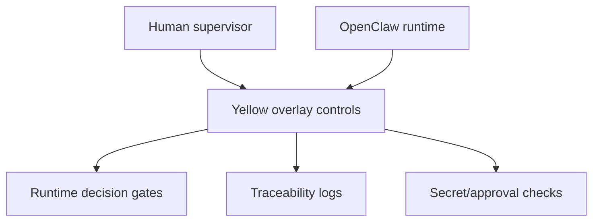
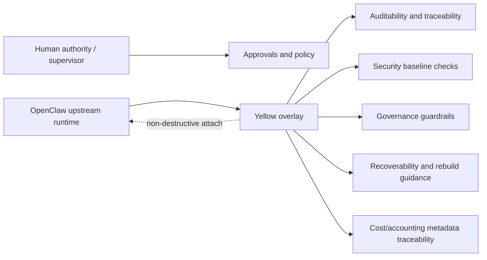

  

# 🟡 Open-Claw Yellow

Project provenance: initiated by Eurobotics Association contributors, with accountable human-in-the-loop supervision.

Assisted-by: ChatGPT GPT-5.4 Thinking [canmore] [chat] (high level design, high level debug, strategy, coherence repo review) , Codex model GPT5.3-codex (full stack code design, patch design , repo management, documentation management), Claude Sonnet 4.6 [chat] (convergence sparing partner, second view debug)

Last-Updated: 2026-04-22

> **The Yellow Open-Claw Project**  
> A practical governance and security overlay for OpenClaw operators.

---

## 🚦 Status

- **Draft:** v0.3
- **Positioning:** public governance/security overlay project around OpenClaw
- **First real implementation target:** **Oscar-26**

---

## ✨ What this repository is

This repository is **Eurobotics-Association/openclaw-yellow**:  
https://github.com/Eurobotics-Association/openclaw-yellow

Open-Claw Yellow is designed as an **attachable layer** that sits on top of OpenClaw for governance, traceability, approval flow, and security baseline operations.

It is intentionally:

- ✅ **not a fork** of OpenClaw
- ✅ **not a replacement** for OpenClaw
- ✅ **not a bloated enterprise compliance framework**

It is a practical overlay for full-stack developers, cyber experts, IT managers, and governance-minded operators.

---

## 🔗 Upstream references (official)

- Official OpenClaw upstream: https://github.com/openclaw/openclaw
- OpenClaw Ansible baseline/reference: https://github.com/openclaw/openclaw-ansible

Yellow follows OpenClaw as upstream authority and uses `openclaw-ansible` as an operational baseline reference for install and host posture.

---

## ⚠️ Why this matters

AI operators can move fast and create value, but without governance they can also create cyber-mayhem: touching code, secrets, infra, and spend without enough control.

- weak traceability creates investigation blind spots
- missing approval gates can allow risky changes too early
- poor secret handling increases leak and abuse risk
- low recoverability makes failure/compromise hard to contain
- weak runtime boundaries can turn small mistakes into expensive incidents

---

## 🧭 Design principles

- practical first, with deployable guardrails
- non-destructive overlay over invasive rewrite
- traceability by default for key actions
- reuse before reinvention
- human approval for critical actions

---

## 👀 Supervision model (at a glance)

---

## 🧭 Core operating model (latest decisions)

Yellow should prefer **wrapper/drop-in/overlay** design over invasive rewrite.

1. Detect existing OpenClaw first.
2. Inventory existing OpenClaw read-only.
3. If absent, install latest official OpenClaw from official upstream path.
4. If older OpenClaw exists, **do not silently force-upgrade**; ask user approval first.
5. Validate vanilla OpenClaw operation.
6. Attach Yellow governance/security layer non-destructively.

Yellow supports two practical modes:

- **Fresh install mode**
- **Attach mode**

In both modes, Yellow should preserve existing user configuration whenever possible.

---

## 🏗️ Overlay architecture (concise)

---

## 🧪 Oscar-26 first implementation track

Oscar-26 is the first real implementation/validation track for Yellow in practical operation.

Publication path is staged: early validation happens in a private track first, then stabilized outcomes are merged into `openclaw-yellow` for the public baseline.

Current near-term milestone: first public stabilized release is targeted for **early May 2026**.

---

## 🧩 Governance scope highlights

Yellow documentation currently focuses on:

- approvals and action boundaries
- traceability and auditability
- secret handling and operational secrecy hygiene
- host security baseline
- communications redundancy (e.g., primary + backup channel)
- recoverability and rebuildability
- accounting/payment metadata traceability (AI operator may spend and generate revenue)

---

## 📚 Documentation map

To keep this README readable, detailed material is split into docs:

- [Architecture](docs/architecture.md)
- [Install Modes](docs/install-modes.md)
- [Security Baseline](docs/security-baseline.md)
- [Oscar-26 First Implementation](docs/oscar-first-implementation.md)
- [Roadmap](docs/roadmap.md)

## 🏷️ Transparency note

This project values clear disclosure of AI-assisted contributions in a contributor-friendly way.

---

## 🗺️ Roadmap (short)

- **Phase 0 — Define:** governance model, install/attach logic, baseline controls.
- **Phase 1 — Prove (Oscar-26):** validate real workflows and non-destructive attach behavior.
- **Phase 2 — Package:** publish reusable docs/templates/playbooks.
- **Phase 3 — Expand:** broaden compatibility and community adoption.

See full details: [docs/roadmap.md](docs/roadmap.md).

---

## 🤝 Contribute / Contact

- GitHub: `rfv-370` at https://github.com/rfv-370
- Email: `contact@eurobotics.org`

Please allow some response time — humans are in the loop. 🙂
