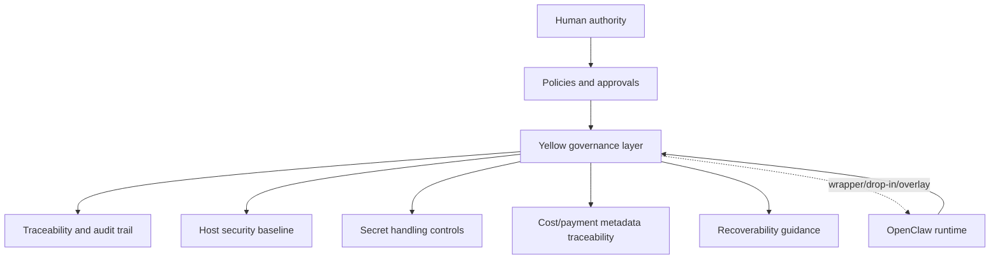

# 🧱 Open-Claw Yellow Architecture

Author: F.M. Robert Vergnes / robert.vergnes@yahoo.fr  
Assisted-by: OpenAI Codex: GPT-5.3-Codex [exec_command] [apply_patch]  
Last-Updated: 2026-04-19

## Purpose

Open-Claw Yellow is an **overlay architecture** for governance and security around OpenClaw.

- It is not a fork.
- It is not a replacement.
- It is not intended to destructively modify a healthy OpenClaw runtime.

## Upstream anchors

- OpenClaw upstream: https://github.com/openclaw/openclaw
- OpenClaw Ansible baseline: https://github.com/openclaw/openclaw-ansible

## Layering logic

## Design principles

1. **Non-destructive by default** (attach over rewrite).
2. **Human authority preserved** for risky actions.
3. **Traceability first** for decisions, actions, and approvals.
4. **Operational pragmatism** over compliance theater.
5. **Reuse mature components** before creating new stack complexity.
