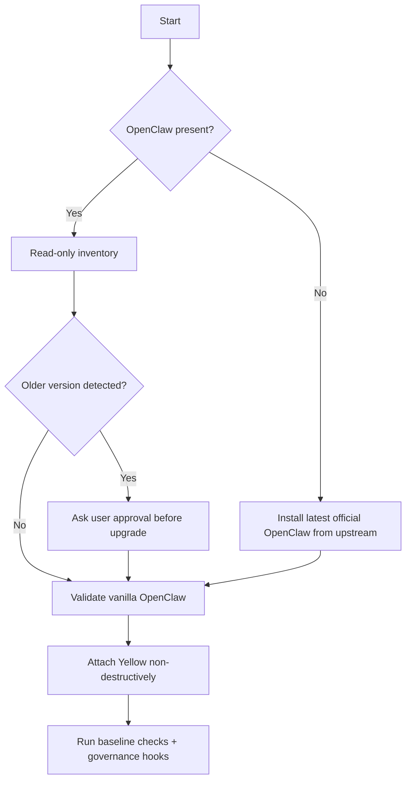

# ⚙️ Open-Claw Yellow Install Modes

Author: F.M. Robert Vergnes / robert.vergnes@yahoo.fr  
Assisted-by: OpenAI Codex: GPT-5.3-Codex [exec_command] [apply_patch]  
Last-Updated: 2026-04-19

## Objective

Support both:

- **Fresh install mode**
- **Attach mode** (existing OpenClaw detected)

while preserving user configuration whenever possible.

## Preferred installation/attachment sequence

## Decision guardrails

- No silent force-upgrade of older OpenClaw instances.
- No destructive overwrite of existing user configurations.
- Validate vanilla OpenClaw behavior before enabling Yellow controls.

## Reference posture

Installation and host-operational posture should remain aligned with:

- https://github.com/openclaw/openclaw
- https://github.com/openclaw/openclaw-ansible
