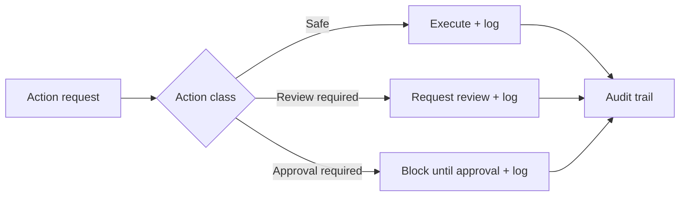

# 🛡️ Open-Claw Yellow Security Baseline (Practical)

Author: F.M. Robert Vergnes / robert.vergnes@yahoo.fr  
Assisted-by: OpenAI Codex: GPT-5.3-Codex [exec_command] [apply_patch]  
Last-Updated: 2026-04-19

## Baseline focus areas

Yellow governance/security overlay currently focuses on practical controls:

- approvals and privileged action boundaries
- traceability and auditability
- secret handling strategy (no plaintext secrets in versioned repos)
- host baseline checks (firewall, service health, suspicious signals)
- communications redundancy for critical alerts
- recoverability and rebuildability
- accounting/payment metadata traceability for AI-operator actions

## Why accounting traceability is included

An AI operator can both **spend money** and **generate revenue**.

Therefore, governance should include minimal but actionable financial traceability metadata (who/what/when/why context for paid actions), without turning this repository into a heavy enterprise accounting suite.

## Practical governance model

## Non-goals

- Not a full SIEM platform.
- Not a full IAM suite.
- Not a replacement for upstream OpenClaw security choices.
